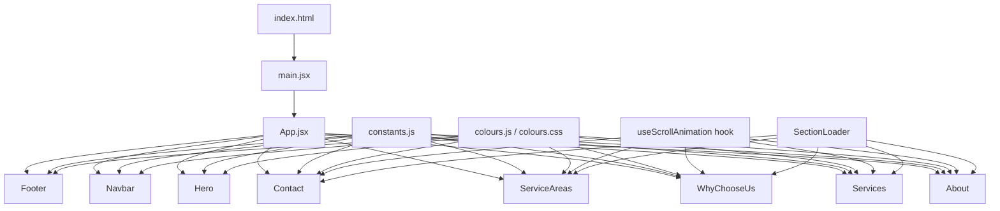

# Design Document

## Overview

This design describes the architecture and implementation of the Aulakh Painting Ltd single-page website built with React 19 and Vite 8. The website is a marketing-focused, content-driven site that showcases painting services, builds trust through professional presentation, and drives customer inquiries.

The site follows a component-based architecture with clear separation between layout, section, and UI components. All text content lives in a dedicated constants file, and all colours in a dedicated colours configuration file, enabling easy content updates without touching component code.

Key technical decisions:
- **No routing library** — single-page with smooth scroll navigation via native `scrollIntoView`
- **Intersection Observer API** — for scroll animations and active nav link detection
- **CSS Modules or co-located CSS files** — for component-scoped styling
- **No external animation library** — CSS transitions + Intersection Observer for lightweight scroll effects
- **No form backend** — form submission shows a success message client-side (backend integration deferred)
- **No state management library** — React's built-in useState/useRef is sufficient for this scope

## Architecture



### Directory Structure

```
src/
├── components/
│   ├── layout/
│   │   ├── Navbar.jsx
│   │   ├── Navbar.css
│   │   ├── Footer.jsx
│   │   └── Footer.css
│   ├── sections/
│   │   ├── Hero.jsx
│   │   ├── Hero.css
│   │   ├── About.jsx
│   │   ├── About.css
│   │   ├── Services.jsx
│   │   ├── Services.css
│   │   ├── WhyChooseUs.jsx
│   │   ├── WhyChooseUs.css
│   │   ├── ServiceAreas.jsx
│   │   ├── ServiceAreas.css
│   │   ├── Contact.jsx
│   │   └── Contact.css
│   └── ui/
│       ├── ServiceCard.jsx
│       ├── ServiceCard.css
│       ├── CTAButton.jsx
│       ├── CTAButton.css
│       ├── ImagePlaceholder.jsx
│       ├── ImagePlaceholder.css
│       ├── SectionLoader.jsx
│       └── SectionLoader.css
├── config/
│   ├── constants.js
│   └── colours.js
├── hooks/
│   ├── useScrollAnimation.js
│   └── useActiveSection.js
├── styles/
│   └── colours.css
├── assets/
│   └── images/
├── App.jsx
├── App.css
├── index.css
└── main.jsx
```

## Components and Interfaces

### Layout Components

#### Navbar

```jsx
// Props: none (reads from constants)
// State: isMobileMenuOpen, activeSection
function Navbar() {
  // Uses useActiveSection hook to track which section is in viewport
  // Renders company name + nav links
  // Handles hamburger toggle for mobile
  // Smooth-scrolls to section on link click
}
```

**Behaviour:**
- Fixed position at top (`position: sticky; top: 0; z-index: 1000`)
- Active section detection via `useActiveSection` custom hook (Intersection Observer)
- Mobile menu: hamburger icon toggles vertical nav, closes on link click or outside click
- Smooth scroll: `element.scrollIntoView({ behavior: 'smooth' })`

#### Footer

```jsx
// Props: none (reads from constants)
function Footer() {
  // Renders company info, contact links, social links, quick nav, copyright
}
```

### Section Components

Each section component follows this pattern:

```jsx
function SectionName() {
  const [isLoaded, setIsLoaded] = useState(false);
  const sectionRef = useRef(null);
  useScrollAnimation(sectionRef);

  useEffect(() => {
    // Simulate content readiness (constants are synchronous, so immediate)
    setIsLoaded(true);
  }, []);

  if (!isLoaded) return <SectionLoader layout="section-name" />;

  return (
    <section id="section-id" ref={sectionRef} className="scroll-animate">
      {/* Section content */}
    </section>
  );
}
```

#### Hero Section
- Full viewport height (100vh)
- Fade-up animation on load (CSS animation, not scroll-triggered)
- Two CTA buttons: "Get Free Estimate" (scrolls to contact) and phone number (tel: link)
- Image placeholder for background/featured image

#### About Section
- Owner name + title, portrait image placeholder, description, values list
- Scroll animation triggered at 20% visibility

#### Services Section
- Grid of 6 ServiceCard components
- Staggered scroll animation (100ms delay between cards)
- Responsive grid: 3 → 2 → 1 columns

#### WhyChooseUs Section
- Grid of 6 feature items (icon placeholder + title + description)
- Staggered fade-in animation
- Responsive grid: 3 → 2 → 1 columns

#### ServiceAreas Section
- Multi-column list of cities/regions
- Map image placeholder
- Scroll animation at 20% visibility

#### Contact Section
- Contact info (phones, email)
- Form with validation: name, email, phone, service type dropdown, message
- Success/error states
- Mobile: prominent call button

### UI Components

#### ServiceCard

```jsx
// Props: { title, description, subServices, imageSrc, imageAlt }
function ServiceCard({ title, description, subServices, imageSrc, imageAlt }) {
  // Renders card with image placeholder, title, description, sub-service list
  // Hover effect: translateY(-4px) + elevated box-shadow
}
```

#### CTAButton

```jsx
// Props: { label, href, onClick, variant }
// variant: 'primary' | 'secondary' | 'phone'
function CTAButton({ label, href, onClick, variant = 'primary' }) {
  // Renders as <a> if href provided, <button> if onClick provided
  // Minimum touch target: 44x44px
}
```

#### ImagePlaceholder

```jsx
// Props: { width, height, alt, src, className }
function ImagePlaceholder({ width, height, alt, src, className }) {
  // If src provided: renders  with specified dimensions
  // If no src: renders styled placeholder container with camera icon
}
```

#### SectionLoader

```jsx
// Props: { layout }
// layout determines skeleton shape (e.g., 'hero', 'services', 'about')
function SectionLoader({ layout }) {
  // Renders skeleton blocks matching section structure
  // Pulsing gradient animation (1000-2000ms cycle)
  // ARIA live region for accessibility
  // Fade-out transition (300ms) when content ready
}
```

### Custom Hooks

#### useScrollAnimation

```js
function useScrollAnimation(ref, options = {}) {
  // Creates IntersectionObserver with threshold 0.2
  // On intersection: adds 'animate-in' class
  // Respects prefers-reduced-motion media query
  // Triggers only once (unobserves after animation)
  // If element already in viewport on mount: shows immediately without animation
}
```

#### useActiveSection

```js
function useActiveSection(sectionIds) {
  // Creates IntersectionObserver for all sections
  // Tracks which section is closest to top of viewport
  // Returns activeSection id string
}
```

## Data Models

### Constants File Structure (`src/config/constants.js`)

```js
// Company Information
export const COMPANY_NAME = "Aulakh Painting Ltd";
export const HOOK_LINE = "Brush and blend, no rough end.";
export const PRIMARY_PHONE = "672-833-0578";
export const SECONDARY_PHONE = "672-338-7790";
export const EMAIL = "Aulakhpaintingltd@gmail.com";
export const ADDRESS = "British Columbia, Canada";
export const INSTAGRAM_URL = "https://www.instagram.com/aulakh_painting_ltd";

// Navigation Links
export const NAV_LINKS = [
  { id: "home", label: "Home" },
  { id: "about", label: "About" },
  { id: "services", label: "Services" },
  { id: "why-choose-us", label: "Why Choose Us" },
  { id: "service-areas", label: "Service Areas" },
  { id: "contact", label: "Contact" },
];

// Service Categories
export const SERVICES = [
  {
    id: "residential",
    title: "Residential Painting",
    description: "...",
    subServices: ["Interior Wall Painting", "Ceiling Painting", "..."],
  },
  // ... 5 more categories
];

// Why Choose Us Differentiators
export const DIFFERENTIATORS = [
  { id: "guarantee", title: "Workmanship Guarantee", description: "..." },
  { id: "licensed", title: "Fully Licensed and Insured", description: "..." },
  { id: "worksafe", title: "WorkSafeBC Covered", description: "..." },
  { id: "premium", title: "Premium Paints Stains and Materials", description: "..." },
  { id: "estimates", title: "Free Estimates and Consultations", description: "..." },
  { id: "satisfaction", title: "Customer Satisfaction Priority", description: "..." },
];

// Service Areas
export const SERVICE_AREAS = [
  "Vancouver", "Surrey", "Burnaby", "Richmond", "Abbotsford",
  // ... more BC cities
];

// Section Content
export const HERO_CONTENT = { heading: HOOK_LINE, intro: "..." };
export const ABOUT_CONTENT = { heading: "...", ownerName: "Jeevan Singh", title: "Owner/Operator", description: "...", values: [...] };
export const SERVICES_CONTENT = { heading: "..." };
export const WHY_CHOOSE_US_CONTENT = { heading: "..." };
export const SERVICE_AREAS_CONTENT = { heading: "...", note: "..." };
export const CONTACT_CONTENT = { heading: "...", formLabels: {...} };
```

### Colours File Structure (`src/config/colours.js`)

```js
export const COLOURS = {
  primary: "#1B3A5C",       // Deep navy blue
  secondary: "#D4A843",     // Gold accent
  accent: "#2E7D32",        // Forest green
  background: "#FFFFFF",    // White
  backgroundAlt: "#F5F5F5", // Light grey
  text: "#333333",          // Dark grey
  textLight: "#666666",     // Medium grey
  error: "#D32F2F",         // Red
  success: "#388E3C",       // Green
  warning: "#F57C00",       // Orange
};
```

### Colours CSS (`src/styles/colours.css`)

```css
:root {
  --color-primary: #1B3A5C;
  --color-secondary: #D4A843;
  --color-accent: #2E7D32;
  --color-background: #FFFFFF;
  --color-background-alt: #F5F5F5;
  --color-text: #333333;
  --color-text-light: #666666;
  --color-error: #D32F2F;
  --color-success: #388E3C;
  --color-warning: #F57C00;
}
```

### Form Data Model

```js
// Contact form state
{
  fullName: "",      // required, non-empty
  email: "",         // required, valid email format
  phone: "",         // optional
  serviceType: "",   // required, one of SERVICES[].title
  message: "",       // required, minimum 10 characters
}

// Validation errors
{
  fullName: "Full name is required",
  email: "Please enter a valid email address",
  serviceType: "Please select a service type",
  message: "Message must be at least 10 characters",
}
```

### Form Validation Logic (`src/utils/validateForm.js`)

```js
/**
 * Validates contact form data.
 * @param {Object} formData - { fullName, email, phone, serviceType, message }
 * @returns {Object} - { isValid: boolean, errors: { [field]: string } }
 */
export function validateForm(formData) {
  const errors = {};

  if (!formData.fullName || formData.fullName.trim() === "") {
    errors.fullName = "Full name is required";
  }

  if (!formData.email || !isValidEmail(formData.email)) {
    errors.email = "Please enter a valid email address";
  }

  if (!formData.serviceType || formData.serviceType === "") {
    errors.serviceType = "Please select a service type";
  }

  if (!formData.message || formData.message.trim().length < 10) {
    errors.message = "Message must be at least 10 characters";
  }

  return { isValid: Object.keys(errors).length === 0, errors };
}

export function isValidEmail(email) {
  // RFC 5322 simplified: local@domain.tld
  const emailRegex = /^[^\s@]+@[^\s@]+\.[^\s@]+$/;
  return emailRegex.test(email);
}
```

## Correctness Properties

*A property is a characteristic or behavior that should hold true across all valid executions of a system — essentially, a formal statement about what the system should do. Properties serve as the bridge between human-readable specifications and machine-verifiable correctness guarantees.*

### Property 1: Active section detection selects topmost visible section

*For any* set of section elements with known vertical positions and any scroll position where multiple sections are simultaneously visible in the viewport, the `useActiveSection` hook SHALL identify the section whose top edge is closest to the top of the viewport as the active section.

**Validates: Requirements 1.8, 1.9**

### Property 2: Form validation correctness

*For any* form data object, the `validateForm` function SHALL return `isValid: true` with an empty errors object if and only if: fullName is a non-empty trimmed string, email matches a valid email format (contains local@domain.tld structure), serviceType is a non-empty string, and message has at least 10 characters after trimming. For any form data that violates one or more of these rules, the function SHALL return `isValid: false` with error messages keyed to each invalid field.

**Validates: Requirements 7.3, 7.4, 7.5**

### Property 3: Scroll animation triggers exactly once at threshold

*For any* element observed by the `useScrollAnimation` hook, when the element's intersection ratio reaches or exceeds 0.2 for the first time, the animation class SHALL be applied. For any subsequent intersection events on the same element (including leaving and re-entering the viewport), the animation SHALL NOT be re-triggered or removed.

**Validates: Requirements 9.1, 9.4**

### Property 4: Constants data structure completeness

*For any* required data export in the constants file (company information fields, service categories, section content objects, and differentiator items), the export SHALL exist as a named export with all required sub-fields populated as non-empty strings, and each service category SHALL contain a subServices array with at least one item, and each differentiator description SHALL not exceed 120 characters.

**Validates: Requirements 11.1, 11.2, 11.3, 11.5, 5.2**

### Property 5: ImagePlaceholder renders based on props

*For any* valid width and height number props, the ImagePlaceholder component SHALL render a container with those exact dimensions. *For any* non-empty src string prop, the component SHALL render an `` element instead of the placeholder container. *For any* alt text prop, the component SHALL include it in the rendered output, and if the alt text exceeds 125 characters, it SHALL be truncated to 125 characters.

**Validates: Requirements 12.1, 12.2, 12.3**

### Property 6: ServiceCard displays all service data fields

*For any* valid service category object containing a title, description, and subServices array, the ServiceCard component SHALL render all three pieces of information in its output — the title as a heading, the description as body text, and each sub-service as a list item.

**Validates: Requirements 4.2**

## Error Handling

### Form Validation Errors
- **Missing required fields**: Inline error messages displayed adjacent to each invalid field immediately on submit attempt
- **Invalid email format**: Specific error message "Please enter a valid email address"
- **Message too short**: Specific error message "Message must be at least 10 characters"
- **Successful submission**: Success confirmation message replaces the form temporarily

### Section Loading Errors
- **Timeout (10 seconds)**: SectionLoader displays inline error message with retry button
- **Retry mechanism**: Re-triggers the section's mount/load cycle
- **Graceful degradation**: Other sections remain functional if one fails

### Image Loading
- **Missing image src**: ImagePlaceholder renders styled container with camera icon (no broken image)
- **Image load failure**: ImagePlaceholder falls back to placeholder container via `onError` handler

### Scroll Animation Edge Cases
- **Reduced motion preference**: All animations disabled, content rendered at full opacity
- **Section already in viewport on load**: Content shown immediately without animation
- **Rapid scrolling**: IntersectionObserver handles debouncing natively

### Navigation
- **Invalid section ID**: Smooth scroll fails silently (no crash), link remains clickable
- **Mobile menu state**: Menu closes on any navigation action or outside click

## Testing Strategy

### Unit Tests (Example-Based)

Unit tests cover specific rendering, interactions, and edge cases:

- **Navbar**: Renders all links, hamburger toggle works, smooth scroll called on click
- **Hero**: Renders hook line in h1, CTA buttons present with correct labels/links
- **About**: Owner name/title displayed, values list rendered from constants
- **Services**: 6 ServiceCards rendered, responsive grid classes applied
- **WhyChooseUs**: 6 differentiator items rendered
- **ServiceAreas**: Cities list rendered, map placeholder present
- **Contact**: Form fields present, validation errors shown on invalid submit, success message on valid submit
- **Footer**: Company info, phone links, email link, Instagram link with correct attributes, copyright with current year
- **SectionLoader**: Skeleton blocks rendered, ARIA live region present, error state after timeout
- **ImagePlaceholder**: Placeholder shown when no src, image shown when src provided
- **Reduced motion**: Animations disabled when prefers-reduced-motion is set

### Property-Based Tests

Property-based tests verify universal correctness properties using `fast-check`:

- **Property 1**: Generate random section positions and scroll offsets, verify active section detection always picks the topmost visible section
- **Property 2**: Generate random form data (valid and invalid combinations), verify validateForm always returns correct isValid status and appropriate error messages
- **Property 3**: Simulate sequences of intersection events on mock elements, verify animation class is applied exactly once
- **Property 4**: Validate all constants exports have required structure and non-empty values
- **Property 5**: Generate random width/height/src/alt prop combinations, verify ImagePlaceholder renders correctly
- **Property 6**: Generate random service category objects, verify ServiceCard output contains all fields

**PBT Library**: `fast-check` (JavaScript property-based testing library)
**Minimum iterations**: 100 per property test
**Tag format**: `Feature: aulakh-painting-website, Property {number}: {property_text}`

### Integration Tests

- Full page render: All sections compose correctly in App
- Navigation flow: Click nav link → page scrolls to correct section
- Form submission flow: Fill form → submit → success message appears
- Mobile responsive: Hamburger menu opens/closes, layout stacks correctly

### Accessibility Tests

- All images have alt text
- Form fields have associated labels
- ARIA live regions on loaders
- Keyboard navigation through nav links
- Focus management on mobile menu open/close
- Colour contrast ratios meet WCAG AA (4.5:1 for text)

